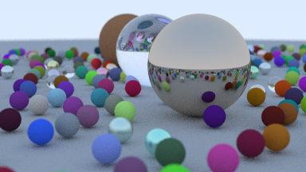

Ray tracing in one weekend
==========================

Following the great introduction into Raytracing named Ray tracing in one Weekend, I created this implementation of a Ray tracer in Rust.

You can find the original tutorial here: <https://raytracing.github.io/books/RayTracingInOneWeekend.html>.

Usage
-----

This is called from the command line.

```shell
rtiow
```

is going to create an image.png of mostly randomly choosen spheres somewhat looking like that within the current directory.



Use `--help` to see more options.
